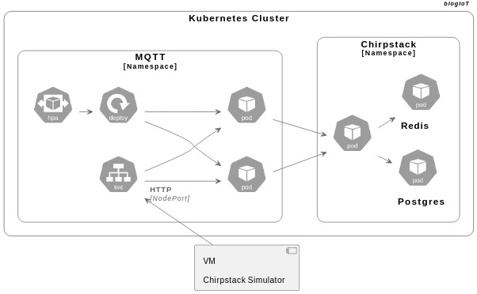

<!-- PROJECT LOGO -->
<br />
<p align="center">
  <a href="http://dropsiot.com.br/">
    
  </a>

  <h3 align="center">Arquitetura Modular para LoRaWAN</h3>

  <p align="center">
    Mário Neto e Inatel
    <br />
    <a href="https://blogiot.com.br"><strong>Explore a documentação »</strong></a>
    <br />
  </p>
</p>

<!-- ABOUT THE PROJECT -->
### Ferramentas
Esse trabalho aborda a montagem de um broker MQTT que escala automaticamente, conforme o uso de CPU. Utilizou-se ferramentas conhecidas na área de devOps. Recomenda-se ter um ambiente de Máquinas Virtuais (VMs) e um cluster Kubernetes

* [Proxmox](https://www.proxmox.com)
* [Kubernetes](https://kubernetes.io)
* [Chirpstack](https://www.chirpstack.io)
* [Chirpstack Simulator](https://github.com/brocaar/chirpstack-simulator)


### Instalação

Foi criado um arquivo makefile para instalação dos microserviços de forma ordenada.
```sh
make all
```

<!-- USAGE EXAMPLES -->
## Uso

Com essa infraestrutura provisionada, é possível o gerenciamento de uma rede de IoT, com LoRaWAN, utilizada em Cidade Inteligente. O servidor Chirpstack permite a criação de APIs externar conectadas em aplicações dedicadas, tipo exemplo do blogIoT


<!-- ARQUITETURA -->
## Aquitetura Provisionada



<!-- CONTRIBUTING -->
## Contribuições

Embora a rede proposta neste trabalho seja simples de replicar, ela adota padrões atualizados e uma arquitetura modular que permite fácil adaptação para ambientes reais. O Estado da Arte indica que, embora existam redes mais complexas, há demanda por soluções didáticas, econômicas e de fácil manutenção. Lacuna que este projeto busca preencher.


<!-- LICENSE -->
## Licença

 Creative Commons Attribution 4.0 International license