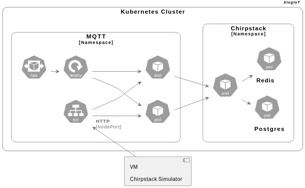

<!-- PROJECT SHIELDS -->
<!--
*** I'm using markdown "reference style" links for readability.
*** Reference links are enclosed in brackets [ ] instead of parentheses ( ).
*** See the bottom of this document for the declaration of the reference variables
*** for contributors-url, forks-url, etc. This is an optional, concise syntax you may use.
*** https://www.markdownguide.org/basic-syntax/#reference-style-links
-->
[![Contributors][contributors-shield]][contributors-url]
[![Forks][forks-shield]][forks-url]
[![Stargazers][stars-shield]][stars-url]
[![Issues][issues-shield]][issues-url]
[![MIT License][license-shield]][license-url]
[![LinkedIn][linkedin-shield]][linkedin-url]


<!-- PROJECT LOGO -->
<br />
<p align="center">
  <a href="https://github.com/othneildrew/Best-README-Template">
    
  </a>

  <h3 align="center">Arquitetura Modular para LoRaWAN</h3>

  <p align="center">
    Mário Neto e Inatel
    <br />
    <a href="https://blogiot.com.br"><strong>Explore a documentação »</strong></a>
    <br />
    <br />
    <a href="https://github.com/othneildrew/Best-README-Template">View Demo</a>
    ·
    <a href="https://github.com/othneildrew/Best-README-Template/issues">Report Bug</a>
    ·
    <a href="https://github.com/othneildrew/Best-README-Template/issues">Request Feature</a>
  </p>
</p>


<!-- TABLE OF CONTENTS -->
## Table of Contents

* [Resumo](#resumo)
  * [Ferramentas](#ferramentas)
* [Getting Started](#getting-started)
  * [Prerequisites](#prerequisites)
  * [Instalação](#instalação)
* [Uso](#uso)
* [Aquitetura Provisionada](#aquitetura-provisionada)
* [Contribuições](#contribuições)
* [Licença](#licença)
* [Contato](#contato)
* [Acknowledgements](#acknowledgements)


<!-- ABOUT THE PROJECT -->
## Resumo
A internet das Coisas (IoT) vem transformando setores como agronegócio, indústria e cidades inteligentes. Em um ecossistema IoT, a infraestrutura precisa lidar com grandes quantidades de dispositivos conectados, mensagens assíncronas e variações bruscas de carga. Nesse cenário, o Kubernetes se apresenta como uma plataforma ideal para garantir disponibilidade, escalabilidade, modularidade no gerenciamento de aplicações e serviços distribuídos.
Nosso trabalho aborda a montagem de um broker MQTT que escala automaticamente, conforme o uso de CPU, em um cluster Kubernetes. O broker MQTT é o serviço central responsável por intermediar a comunicação entre dispositivos que usam o protocolo MQTT (Message Queuing Telemetry Transporte), muito comum em aplicações de IoT pela leveza e eficiência em redes instáveis ou com baixa largura de banda.
O cluster Kubernetes foi configurado na plataforma Proxmox, permitindo o gerenciamento local de máquinas virtuais.
Para simulação das carga, utilizou-se o Chirpstack Simulator, que emula dispositivos LoRaWAN enviando dados para a rede. O servidor Chirpstack é uma plataforma de código aberto composta por vários componentes que, juntos, possibilitam a construção de redes LoRaWAN. Sua utilização neste projeto proporciona um ambiente de teste mais próximo da realidade de uma aplicação IoT massiva, reforçando a relevância da análise de escalabilidade.

### Ferramentas
Este projeto utilizou ferramentas conhecidas na área de devOps.
* [Proxmox](https://getbootstrap.com)
* [Kubernetes](https://jquery.com)
* [Chirpstack](https://laravel.com)
* [Chirpstack Simulator](https://laravel.com)


<!-- GETTING STARTED -->
## Getting Started


### Pré-requisitos

É preciso ter um ambiente de Máquinas Virtuais (VMs). Em nosso caso utilizamos o Proxmox.

### Instalação

Foi criado um arquivo makefile para instalaão dos microserviços de forma ordenada.
```sh
make all
```

<!-- USAGE EXAMPLES -->
## Uso

Com essa infraestrutura provisionada, é possível a criação de uma rede de IoT com LoRaWAN.

O servidor Chirpstack em funcionamento permite a criação de APIs externar, conectadas à aplicações dedicadas - trabalho realizado no blogIoT


<!-- ARQUITETURA -->
## Aquitetura Provisionada



<!-- CONTRIBUTING -->
## Contribuições

Embora a rede proposta neste trabalho seja simples de replicar, ela adota padrões atualizados e uma arquitetura modular que permite fácil adaptação para ambientes reais. O Estado da Arte indica que, embora existam redes mais complexas, há demanda por soluções didáticas, econômicas e de fácil manutenção. lacuna que este projeto busca preencher.


<!-- LICENSE -->
## Licença

 Creative Commons Attribution 4.0 International license


<!-- CONTACT -->
## Contato

Mário Neto - [@may_blog](https://blogiot.com.br) - blogIoT

Link do Projeto: [https://github.com/mgneto26/kubeChirpstack](https://github.com/mgneto26/kubeChirpstack)


<!-- ACKNOWLEDGEMENTS -->
## Acknowledgements
* [GitHub Emoji Cheat Sheet](https://www.webpagefx.com/tools/emoji-cheat-sheet)
* [Img Shields](https://shields.io)
* [Choose an Open Source License](https://choosealicense.com)
* [GitHub Pages](https://pages.github.com)
* [Animate.css](https://daneden.github.io/animate.css)
* [Loaders.css](https://connoratherton.com/loaders)
* [Slick Carousel](https://kenwheeler.github.io/slick)
* [Smooth Scroll](https://github.com/cferdinandi/smooth-scroll)
* [Sticky Kit](http://leafo.net/sticky-kit)
* [JVectorMap](http://jvectormap.com)
* [Font Awesome](https://fontawesome.com)


<!-- MARKDOWN LINKS & IMAGES -->
<!-- https://www.markdownguide.org/basic-syntax/#reference-style-links -->
[contributors-shield]: https://img.shields.io/github/contributors/othneildrew/Best-README-Template.svg?style=flat-square
[contributors-url]: https://github.com/othneildrew/Best-README-Template/graphs/contributors
[forks-shield]: https://img.shields.io/github/forks/othneildrew/Best-README-Template.svg?style=flat-square
[forks-url]: https://github.com/mgneto26/kubeChirpstack/forks
[stars-shield]: https://img.shields.io/github/stars/othneildrew/Best-README-Template.svg?style=flat-square
[stars-url]: https://github.com/othneildrew/Best-README-Template/stargazers
[issues-shield]: https://img.shields.io/github/issues/othneildrew/Best-README-Template.svg?style=flat-square
[issues-url]: https://github.com/othneildrew/Best-README-Template/issues
[license-shield]: https://img.shields.io/github/license/othneildrew/Best-README-Template.svg?style=flat-square
[license-url]: https://github.com/mgneto26/kubeChirpstack?tab=License-1-ov-file#readme
[linkedin-shield]: https://img.shields.io/badge/-LinkedIn-black.svg?style=flat-square&logo=linkedin&colorB=555
[linkedin-url]: https://linkedin.com/in/othneildrew
[product-screenshot]: images/screenshot.png
